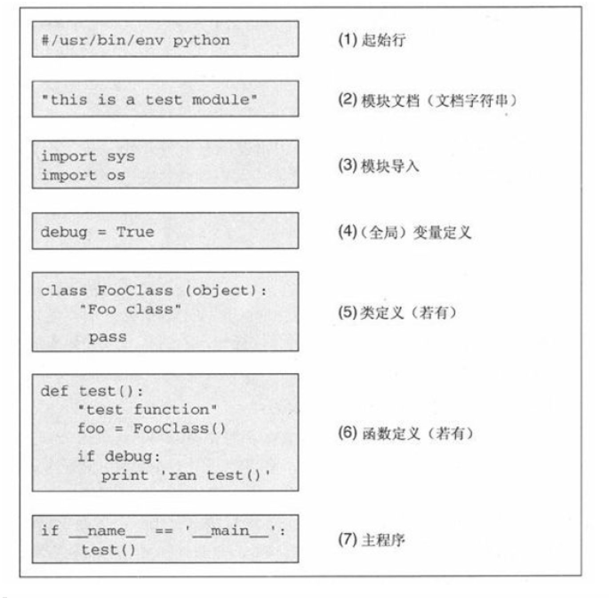

Python手册
========
快速入门
--------

::

    三种运行:交互式的启动解释器、命令行启动脚本、集成开发环境

    特殊字符: 
         单行:#   多行 ''' '''
         换行\: 继续上一行
         赋值=: x,y,z=1,2,3  
         下划线标识符：_XXX类中的私有变量名

    字符串重要的操作符: 
         说明：[] 索引操作符、[i:j] 切片操作符，最后一个索引是 -1 
         案例：如果是[3:5] 是从3开始到4结束 [3] 是从3到最后

    列表相关的重要操作符:
         说明： 切片运算[:] 可以得到子集，这点和字符串相同

    字典
         说明： dict 或者 {} for key in dict

    for循环与range
         说明： 接受可迭代对象，每次迭代取一个元素，
               range()函数得到的其实是一个iterable类型，在python里解释为可以迭代的对象，可以使用for来遍历产生的结果，使用list()将结果转化为列表类型  

    列表解析
         说明： [expression for iter_val in iterable if cond_expr] 使用循环将所有值放入一个列表中

    错误和异常
         说明：  python无法正常处理程序，就会产生一个异常，try except语句可以捕获或者处理异常   
         案例：
                try:
                    <语句>        #运行别的代码
                    except <名字>：
                    <语句>        #如果在try部份引发了'name'异常
                    except <名字>，<数据>:
                    <语句>        #如果引发了'name'异常，获得附加的数据
                    else:
                    <语句>        #如果没有异常发生               

========
开发模板
========

::

    __name__如何能区分能在运行时检测该模块是被导入还是被直接执行呢？
    1。如果模块是被导入，__name__的值为模块名字；
    2.如果模块是被直接执行，__name__的值为‘main’
    3.将测试代码放在一个叫做main()或test()（或者你随便取个名字）的函数中，如果该模块是被当成脚本运行，就调用这个函数

========
内存管理
========

::

    1.无需声明，直接定义
    2.动态类型
    3.自动完成内存分配回收【不智能】：变量引用对象，计算对象被不同变量引用的个数决定对象的生命周期
        3.1 引用计数法
            增加计数：对象被创建并（将其引用）赋值给变量时，该对象的引用计数就+1
            减小计数：
                    当变量被赋值给另外一个对象时
                    引用的局部变量被销毁
                    del 删除一个引用变量
        3.2 垃圾收集说明
            一个循环引用发生在当你有至少两个对象互相引用时，也就是说所有的引用都消失时，这些
            引用仍然存在，这说明只靠引用计数是不够的。Python的垃圾收集器实际上是一个引用计数
            器和一个循环垃圾收集器。当一个对象的引用计数变为0,解释器会暂停，释放掉这个对象和仅
            有这个对象可访问 （可到达）的其他对象。作为引用计数的补充，垃圾收集器也会留心被分
            配的总量很大的（及未通过引用计数销毁的那些）对象。在这种情况下，解释器会暂停下
            来，试图清理所有未引用的循环。            

========
类型说明
========

::

    1.获取数据类型的内建函数type
    2.所有类型对象的类型都是type,它也是所有Python类型的根和所有Python标准类的默认元类（metadass）
    3.空对象、值为零的任何数字或者Null对象None的布尔值都是False
    4.Python提供了 is和is not操作符来测试两个变量是否指向同一个对象。
      type()和 isinstance(变量名，(类型))

========
模块相关
========  

::

    函数:将一组代码组织到一起，实现某种功能
    模块:为实现某种逻辑将相关连的函数写在同一个文件里，使逻辑更清楚，这就是一个模块,在python中文件以.py 结尾，那这个.py文件就可以称之为模块
    包：方便管理模块，python 中引入了包的概念，包是由关联的多个模块组成的目录，包下而都有一个__init__.py文件否则就是普通目录

    引入模块：
            import:导入模块的所有 import xx ,引用xx.a xx.b
            from import:导入模块的部分 
                from xx import yyy 或者 from os import * ,引用 yyy
                由于引用的时候没有模块的前缀，可能导致重名函数打乱命名空间
    
    Python import 的搜索路径：
            在当前目录下搜索该模块
            在环境变量 PYTHONPATH 中指定的路径列表中依次搜索
            在 Python 安装路径的 lib 库中搜索

    绝对导入和相对导入：
            绝对导入：一个模块只能导入自身的子模块或和它的顶层模块同级别的模块及其子模块
            相对导入：参照当前所在文件的文件夹为起始开始查找,称之为相对导入
                     符号: .代表当前所在文件的文件加,..代表上一级文件夹,...代表上一级的上一级文件夹
                     优点: 导入更加简单
                     缺点: 只能在导入包中的模块时才能使用,不能在执行文件中用
            
========
学习资料
========   

::

    相关模块和开发工具:
    《Python风格指南》（Python Style Guide,PEP8）、《Python快速参考指南》（Python
    Quick Reference Guide）和《Python常见问答》（Python FAQ）都是开发者很重要的“工
    具”。另外，还有一些模块会帮助你成为一个优秀的Python程序员。
    调试器：pdbo
    记录器：logging。
    性能测试器：profile、hotshot、cProfile。
   
    
            
