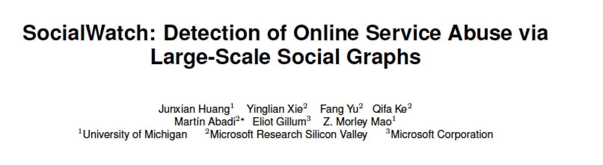

RST文件语法
-------------
章节标题
=======
章节头部由下线（也可有上线）和包含标点的标题组合创建

可以表示标题的符号有 =，- ，+，*，#，`，:，'，"，~，^，_，<，>

对于相同的符号，有上标是一级标题，没有上标是二级标题

标题最多分六级，可以自由组合使用

全加上标或者全不加上标，使用不同的6个符号的标题依次排列，则会依次生成的标题为H1-H6

段落
=======
段落是被空行分割的文字片段，左侧必须对齐（没有空格，或者相同的空格）

缩进的段落没视为引文

    例如:文章来自XXXX

列表
=======
符号列表使用 -，+，*

不同的符号结尾需要加上空行，下级列表需要有缩进空格

- 列表1

- 列表2

    - 下级列表1

    - 下级列表2

顺序列表

可以使用的顺序序号有：

1. 阿拉伯数字：1,2,3 ...
2. 大写字母A-Z
3. 小写字母a-z
4. 大写罗马数字：I, II, III, IV，V...
#. 顺序列表可以借助 # 自动生成顺序

代码块
=======

在需要插入文本块的段落后面加上 :: ，接着一个空行，然后就是文字块了。 文字块开头要有缩进，结束标志是新的一段文本贴开头（即没有缩进）

::

    import os
    os.system("ls")

超链接
=======

reStructuredText会自动将网址生成超链接。

比如：https://github.com/mike-zhang

另外一种形式：`mikeGithub <https://github.com/mike-zhang>`_

图片
=======
示例如下：

